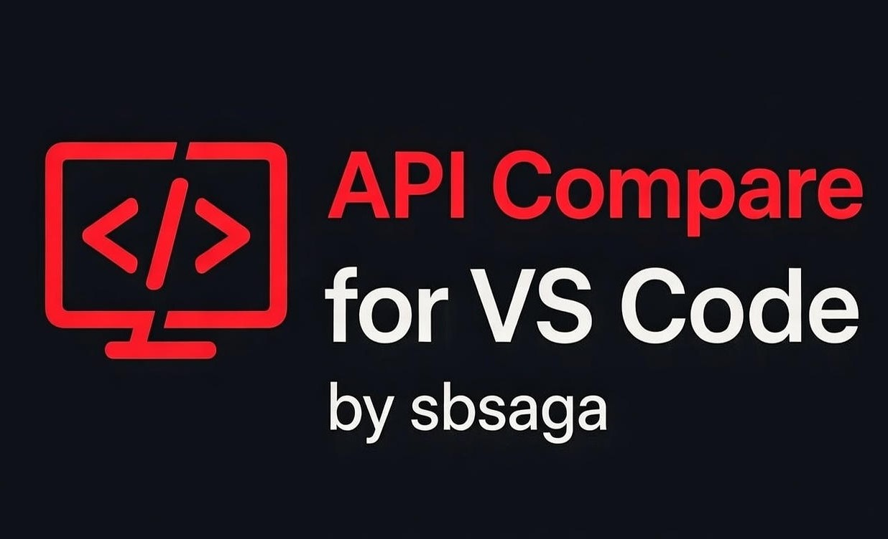

# API Response Compare

[](https://marketplace.visualstudio.com/items?itemName=sbsaga.api-response-compare)
[](https://marketplace.visualstudio.com/items?itemName=sbsaga.api-response-compare)
[](LICENSE)
[](https://github.com/sbsaga/api-response-compare/stargazers)
[](https://github.com/sbsaga/api-response-compare/issues)

---

## ⭐ Give it a Star!

If you like this extension and find it useful, **please give it a star on GitHub**!  
It helps us grow and keep improving.

[Star on GitHub](https://github.com/sbsaga/api-response-compare)

---

## 🚀 Overview

**API Response Compare** is a professional Visual Studio Code extension that allows developers and testers to **quickly compare API responses** in JSON format.  
Whether you're testing APIs, validating endpoints, or debugging integrations, this tool saves time and makes differences clear.

---

## ✨ Why Use This Extension?

- Instantly spot differences between two API responses  
- Perfect for **backend developers, QA engineers, and testers**  
- No external tools needed — everything happens inside VS Code  
- Lightweight, fast, and intuitive  

---

## 🔥 Features

- Compare **any two APIs** (GET / POST)  
- Highlight **added, removed, or changed fields**  
- Supports JSON bodies and query parameters  
- Shows a clear **tabular comparison output**  
- Works with **REST APIs and Lambda endpoints**  
- Minimal setup — install and use immediately  

---

## 📌 Installation

### From VS Code Marketplace:

1. Open VS Code  
2. Go to Extensions (Ctrl+Shift+X)  
3. Search for `API Response Compare`  
4. Click **Install**

### Or via CLI:

```bash
code --install-extension sbsaga.api-response-compare
```

---

## 🎯 How to Use

1. Press `Ctrl+Shift+P` (Cmd+Shift+P on Mac)  
2. Type `Compare Two APIs` and select the command  
3. Enter the first API URL  
4. Enter the second API URL  
5. Select HTTP method (GET / POST)  
6. Enter JSON body if required  
7. Click **Compare**  
8. View the **differences clearly** in a table  

---

## 📊 Example

**API 1 Response:**

```json
{
  "fieldA": "value1",
  "fieldB": "value2",
  "fieldC": "value3"
}
```

**API 2 Response:**

```json
{
  "fieldA": "value3",
  "fieldB": "value2",
  "fieldD": "newField"
}
```

**Comparison Output:**

| Field   | Change Type       | API 1 Value | API 2 Value |
|---------|-----------------|-------------|-------------|
| fieldA  | Value Changed    | value1      | value3      |
| fieldC  | Field Removed    | value3      | -           |
| fieldD  | New Field Added  | -           | newField    |

---

## 📷 Screenshots / Demo

  
*Instantly compare API responses in a professional view.*

---

## 💡 Tips & Tricks

- Ignore dynamic fields like timestamps for cleaner comparison  
- Use consistent HTTP methods for accurate diff results  
- Integrate into your workflow for **continuous API testing**  

---

## 🛠️ Contributing

We love contributions! Here's how you can help:

1. Fork the repo: [GitHub Link](https://github.com/sbsaga/api-response-compare)  
2. Make your changes  
3. Submit a pull request  

Every contribution is **highly appreciated**, whether it’s bug fixes, feature enhancements, or documentation improvements.  

---

## 📖 Changelog

**v1.0.0** – Initial release  
- Fully functional API comparison  
- GET / POST support  
- Tabular diff output

---

## ❤️ Support & Feedback

- Report bugs or request features: [Issues](https://github.com/sbsaga/api-response-compare/issues)  
- Star the project on GitHub to support development: [⭐ Star](https://github.com/sbsaga/api-response-compare/stargazers)  

---

## 📜 License

MIT License – see [LICENSE](LICENSE)
